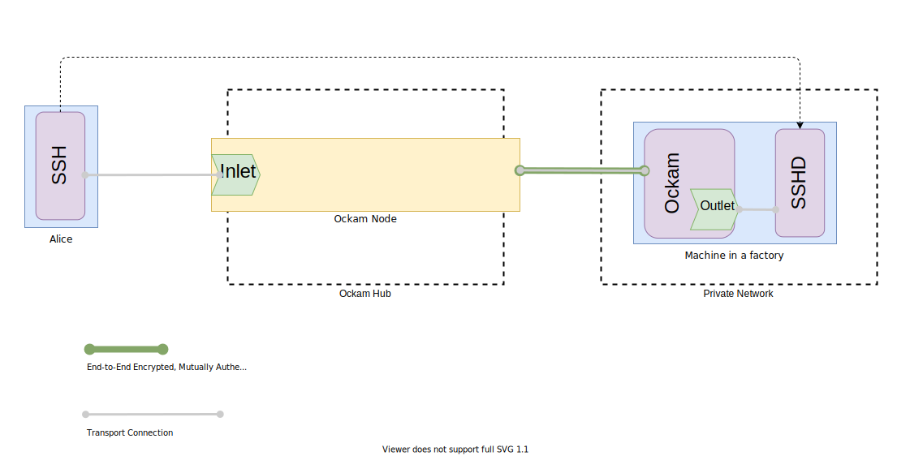

# Secure Remote Access using Ockam Hub

In this guide, we'll use SSH protocol to connect from user machine (Alice) to a remote machine, that is not able
to listen on publicly-available IP, using TCP tunneling via cloud service, called Ockam Hub. For simplicity,
user and remote machines can be different terminal tabs on the same machine.
In this [code example](#rust-example), remote machine is running rust executable, that will create secure
TCP connection to Ockam Hub, receive a port that can be used from user machine to tunnel SSH TCP stream
to the remote machine.

<p>
<a href="#rust-example">

</a>
</p>

## Rust Example

### Presequites

First of all you should make sure you have enabled ssh daemon on a remote machine you want to connect to. In order to check that, run following command on the remote machine


```bash
ssh localhost
```

If that succeeds, you're good to proceed further, if not, please refer to your OS-specific instruction (e.g. [MacOS](https://support.apple.com/en-gb/guide/mac-help/mchlp1066/mac)).

### Creating a personal node on Ockam Hub

1. Go to https://hub.ockam.network/
1. Sign in with your Github account
1. Press _Create Boundary Node_ (FIXME: Rename button)

### Remote Setup

If you don't have Rust, please install the latest version [here](https://www.rust-lang.org/tools/install).

```
curl --proto '=https' --tlsv1.2 -sSf https://sh.rustup.rs | sh
```

Next, create a new cargo project to get started:

```
cargo new --bin secure_remote_access && cd secure_remote_access
    && echo 'ockam = "*"' >> Cargo.toml && cargo build
```

If the above instructions don't work on your machine please
[post a question](https://github.com/ockam-network/ockam/discussions/1642),
we would love to help.

### Run Ockam on Remote Machine

Go to file `main.rs` and copy the below code snippet to it.

```rust
use ockam::{
    route, Context, Entity, Result, SecureChannels, TcpTransport, TrustEveryonePolicy, Vault, TCP,
};

#[ockam::node]
async fn main(mut ctx: Context) -> Result<()> {
    let vault = Vault::create(&ctx)?;
    let mut fabric_machine = Entity::create(&ctx, &vault)?;

    let tcp = TcpTransport::create(&ctx).await?;

    let ockam_hub_hostname = "OCKAM_HUB_NODE_HOSTNAME:4000";

    let channel = fabric_machine.create_secure_channel(
        route![(TCP, ockam_hub_hostname), "secure_channel_listener"],
        TrustEveryonePolicy,
    )?;

    tcp.create_outlet("outlet", "localhost:22").await?;

    ctx.send(route![channel, "inlet_fabric"], "outlet".to_string())
        .await?;

    let port = ctx.receive::<i32>().await?.take().body();
    println!("Inlet is accessible on port {}", port);

    Ok(())
}
```

Replace ```OCKAM_HUB_NODE_HOSTNAME``` with hostname from your Ockam Hub web page. Make sure the web page is showing
Status ```Ready``` for your node, meaning it's ready to accept connection, this may take some time.

### Run the example

1. Run Remote's program:

    ```
    cargo run
    ```

    The Remote's program creates a TCP connection to your Ockam Hub Node, and runs Secure Channel on top
    of that connection. Messages that come from that Channel are then streamed to your local SSH daemon, 
    at ```localhost:22```

2. After successful connection Remote's program will print message ```Inlet is accessible on port 5000```, which
means your node is listening on port 5000 for incoming SSH connections, that will be redirected to the Remote machine.

### Alice machine

Open terminal and start SSH connection. Replace OCKAM_HUB_NODE_HOSTNAME with hostname from your Ockam Hub web page.

```bash
ssh OCKAM_HUB_NODE_HOSTNAME -p 5000
```

After that, you'll be asked to approve public key fingerprint (which is Remote's SSH public key). Upon successful
conenction you'll be asked to provie password for a Remote's user.

## Step by step analysis of Remote's snippet

// TODO: Go step by step through Remote's snippet, explain every line, introduce and explain Inlet&Outlet idea.

## Conclusion

// TODO

## Demo

// TODO: Add video
